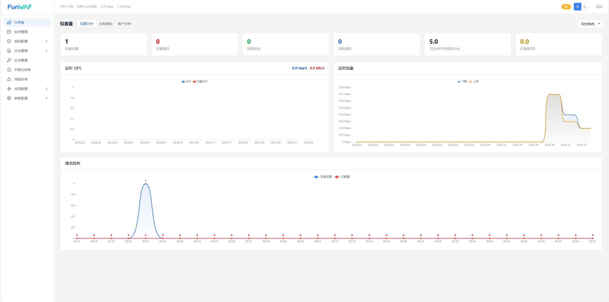
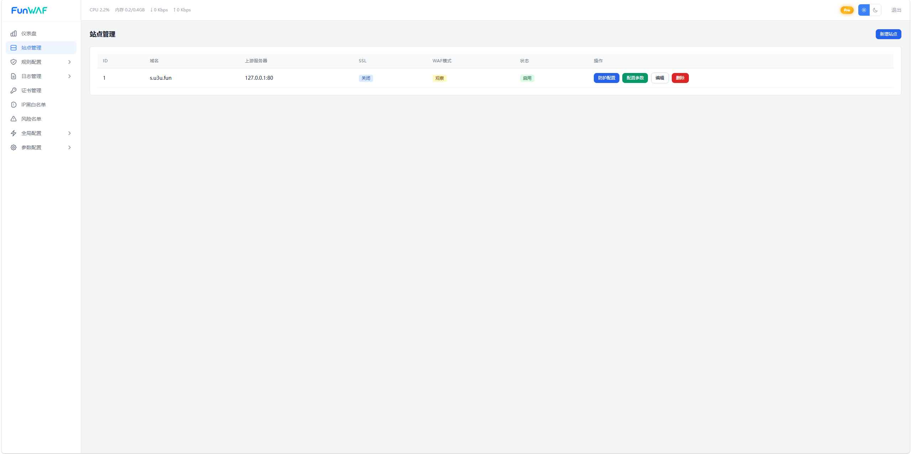
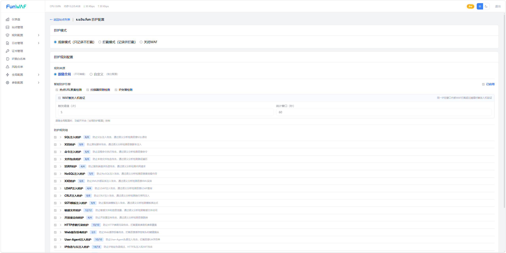
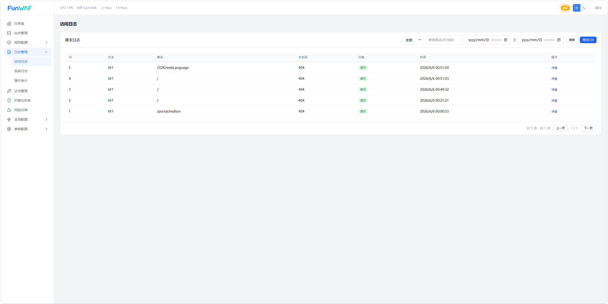
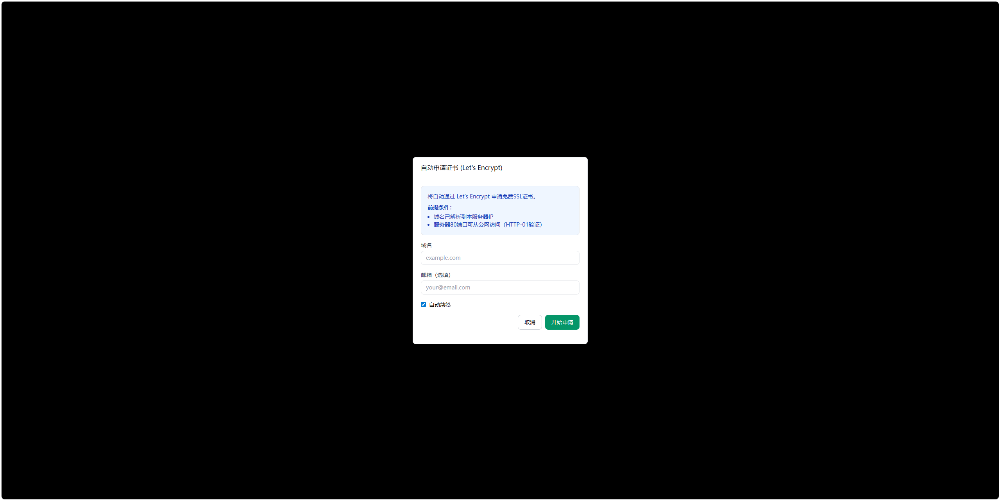
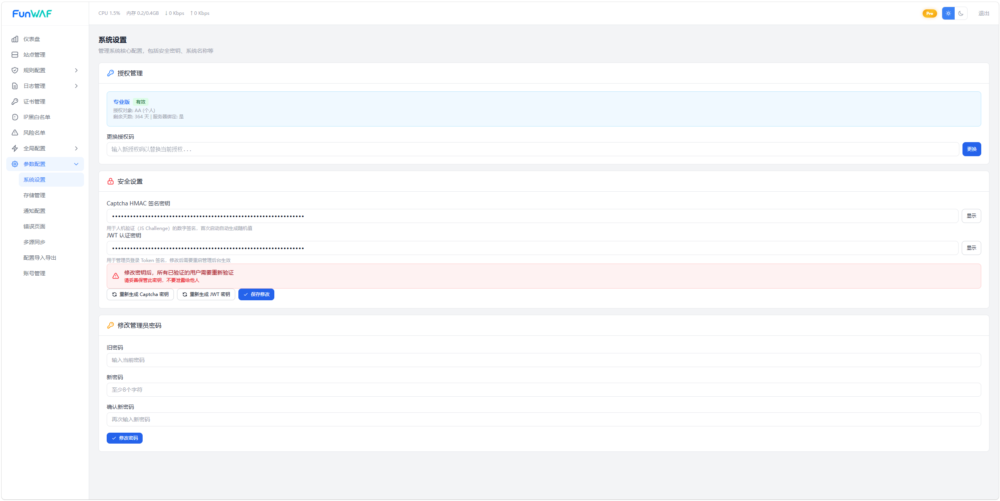
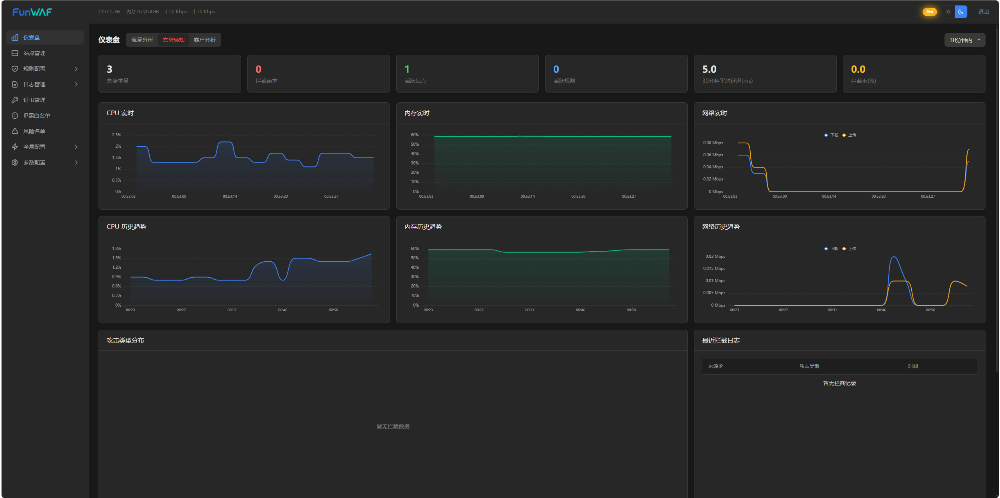

<p align="center">
  
  <br>
  
</p>

<h1 align="center">FunWAF</h1>

<p align="center">
  <strong>高性能 Web 应用防火墙</strong>
</p>

<p align="center">
  
  
  
  
</p>

---

## FunWAF 是什么？

FunWAF 是一款基于 Rust 构建的新一代 Web 应用防火墙（WAF），采用 Cloudflare 开源的 Pingora 高性能代理框架作为流量引擎，结合自研的语义分析引擎，提供精准、低误报的 Web 安全防护。

同时提供现代化的可视化管理控制台，支持多站点管理、实时日志、证书自动续签、多源同步等企业级功能。

---

## 界面展示

### 预览Demo
[预览Demo页面](https://waf.quqimeng.com/demo/)
Demo页面制作中...
Demo账号: demo
Demo密码: 12345678

### 仪表盘

实时监控 CPU、内存、网络流量，请求统计与攻击趋势一目了然。



### 站点管理

多站点独立配置，域名、上游服务器、SSL、WAF 模式一键管理。



### WAF 防护规则

16 大类安全规则，按需启用/关闭，支持站点级和全局级配置。



### 实时日志

访问日志与攻击日志实时查看，支持全文检索与过滤。



### 证书管理

自动申请 Let's Encrypt 证书，支持手动上传，一键续签。



### 系统设置

授权管理、安全密钥配置、密码修改，一站式系统管理。



### 深色模式

完整支持深色主题，护眼舒适。



---

## 核心特性

### 安全防护引擎

| 能力 | 说明 |
|------|------|
| **SQL 注入检测** | 基于语义分析（sqlparser），精准识别 SQL 注入，支持 MySQL / PostgreSQL / SQLite / MSSQL / Oracle 方言 |
| **XSS 检测** | 语义级 HTML/JS 解析，识别 `<script>`、事件处理器、`javascript:` 协议等 XSS 向量 |
| **SSTI 模板注入** | 覆盖 Jinja2 / Twig / FreeMarker / Velocity / .NET Razor / 表达式注入 |
| **RCE 远程命令执行** | 检测 Unix/Windows 命令注入、管道符绕过、反引号执行等 |
| **LFI 本地文件包含** | 路径遍历检测，支持 `../` / 编码绕过 / 双写绕过 |
| **SSRF 服务端请求伪造** | 拦截内网 IP、云元数据 `169.254.169.254`、DNS Rebinding |
| **XXE XML 外部实体** | 检测外部实体注入、参数实体、DTD 远程加载 |
| **NoSQL 注入** | MongoDB 操作符注入 `$gt` / `$ne` / `$regex` 等 |
| **LDAP 注入** | 拦截 LDAP 过滤器注入 `*)(\|(` 等 |
| **CRLF 注入** | 检测 HTTP 头部注入、响应拆分 |
| **开放重定向** | 识别 `//evil.com`、`@` 绕过、协议跳转等 |
| **反序列化攻击** | Java / PHP / Python 反序列化特征检测 |
| **敏感文件泄露** | `.git` / `.env` / `.svn` / SSH 密钥 / 云凭证 / 数据库备份等 |
| **HTTP 参数污染** | HPP 绕过检测 |
| **编码绕过识别** | 自动解码 URL / 双重 URL / HTML 实体 / Unicode / 全角字符 / Base64 |

### 代理与流量

- **Pingora 高性能代理**：Cloudflare 开源框架，异步非阻塞，单核万级并发
- **多站点管理**：独立域名、独立上游、独立 WAF 策略
- **负载均衡**：多上游服务器，权重分配
- **SSL/TLS 终端**：自动申请 Let's Encrypt 证书，自动续签
- **HTTP 跳转 HTTPS**：一键开启强制 HTTPS

### 智能防护

- **智能守卫（Smart Guard）**：热点路径检测、扫描器识别、IP 突发访问、WAF 人机验证
- **IP 信誉系统**：基于行为的 IP 信誉评分，自动识别恶意 IP
- **CC 攻击防护**：滑动窗口 + 令牌桶双算法限流
- **人机验证**：内置 CAPTCHA 验证，支持页面级和非页面级动作
- **等待室（Waitroom）**：高并发场景下排队机制，保护后端

### 管理与运维

- **可视化管理控制台**：现代化 Web UI，深色/浅色主题
- **实时仪表盘**：CPU / 内存 / 网络流量 / 请求统计 / 攻击趋势
- **实时日志**：访问日志 + 攻击日志，支持全文检索
- **审计日志**：操作审计追踪
- **多源同步**：主从架构，配置一键同步到多台服务器
- **配置导入导出**：JSON 格式，支持覆盖/合并导入
- **通知系统**：邮件通知，攻击告警推送
- **账号管理**：管理员 / 子账号，细粒度权限控制
- **Pro 授权**：授权码激活，支持个人/企业授权

---

## 支持的操作系统

FunWAF 安装脚本已适配以下 Linux 发行版：

### RPM 系（RHEL 兼容）

| 发行版 | 版本 | 状态 |
|--------|------|------|
| CentOS | 7, 8, 9 | 完全支持 |
| Rocky Linux | 8, 9 | 完全支持 |
| AlmaLinux | 8, 9 | 完全支持 |
| Red Hat Enterprise Linux | 7, 8, 9 | 完全支持 |
| Alibaba Cloud Linux | 2, 3, 4 | 完全支持 |
| Anolis OS | 7, 8 | 完全支持 |
| OpenCloudOS | 7, 8 | 完全支持 |
| TencentOS | 2, 3 | 完全支持 |
| Kylin | V7, V10 | 完全支持 |

### APT 系（Debian 兼容）

| 发行版 | 版本 | 状态 |
|--------|------|------|
| Ubuntu | 20.04, 22.04, 24.04+ | 完全支持 |
| Debian | 10, 11, 12+ | 完全支持 |

> 架构要求：**x86_64 (amd64)**
>
>其他版本请自行测试(只要版本不是非常老旧都是可以运行的)

---

## 系统架构

```
                    ┌─────────────────────────────────────────┐
                    │              FunWAF 架构                │
                    └─────────────────────────────────────────┘

  客户端请求 ──▶ ┌──────────┐     ┌──────────────┐     ┌─────────────┐
                │  Pingora  │───▶│  WAF Engine  │───▶│  后端服务器  │
                │  代理引擎  │     │  语义分析引擎 │     │  (Upstream) │
                └──────────┘      └──────────────┘     └──────────────┘
                     │                │
                     │                ▼
                     │         ┌──────────────┐
                     │         │  风控引擎     │
                     │         │  IP 信誉系统  │
                     │         │  智能守卫     │
                     │         │  CC 防护      │
                     │         └──────────────┘
                     │
                     ▼
                ┌──────────┐    ┌─────────────────┐
                │  Admin   │───▶│  PostgreSQL    │
                │  管理后台 │    │  (funwaf-pgsql) │
                └──────────┘    └─────────────────┘
                     │
                     ▼
                ┌───────────┐
                │  Web UI   │
                │  管理控制台│
                └───────────┘
```

---

## 组件说明

| 组件 | 说明 |
|------|------|
| `funwaf-proxy` | 代理引擎，基于 Pingora，处理流量转发与 WAF 检测 |
| `funwaf-admin` | 管理后台，提供 RESTful API 和 Web UI |
| `funwaf-engine` | WAF 检测引擎，规则匹配 + 语义分析 |
| `funwaf-ratelimit` | 限流库，滑动窗口 + 令牌桶算法 |
| `funwaf-common` | 公共类型与常量 |

---

## 快速安装

方法1:
```bash
# 一键安装最新版
bash <(curl -sSL https://fun.quqimeng.com/waf/static/funwaf.sh)
```


方法2:
```bash
# 解压发布包
tar xzf funwaf-x.x.x-linux-x86_64.tar.gz
cd funwaf-x.x.x-linux-x86_64

# 安装（自动安装 PostgreSQL、配置服务、初始化数据库）
sudo bash install-release.sh install

# 卸载
sudo bash install-release.sh uninstall

# 升级
sudo bash install-release.sh upgrade
```

安装脚本会自动完成：
1. 系统依赖检测与安装
2. PostgreSQL 安装与初始化（统一 `funwaf-pgsql` 服务，数据目录 `/opt/funwaf/pgsql`）
3. 数据库用户与库创建
4. Systemd 服务注册（`funwaf-admin`、`funwaf-proxy`、`funwaf-pgsql`）
5. 防火墙端口放行

---

## 服务管理

```bash
# 查看状态
systemctl status funwaf-admin funwaf-proxy funwaf-pgsql

# 重启服务
systemctl restart funwaf-admin funwaf-proxy

# 查看日志
journalctl -u funwaf-admin -f
journalctl -u funwaf-proxy -f
```

---


## 目录结构

```
/opt/funwaf/              # 安装目录
├── bin/                  # 二进制文件
│   ├── funwaf-proxy
│   └── funwaf-admin
├── .env                  # 环境配置
└── pgsql/                # PostgreSQL 数据（funwaf-pgsql 服务）
    ├── data/             # 数据库文件
    └── logfile           # PG 日志

/etc/funwaf/              # 配置目录
├── frontend/             # 前端静态文件
└── proxy.toml            # 代理配置

/var/log/funwaf/          # 日志目录
```

---

## 授权

- **免费版**：基础 WAF 防护功能，适合个人和小型站点
- **Pro 版**：解锁账号管理、错误页面自定义、配置导入导出、多源同步等企业级功能

[购买 Pro 授权](https://fun.quqimeng.com/waf/buy/) https://fun.quqimeng.com/waf/buy/

---

## License

Apache-2.0
